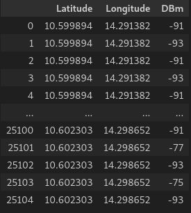
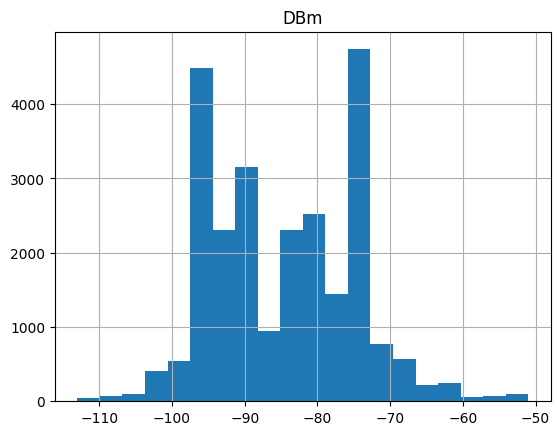
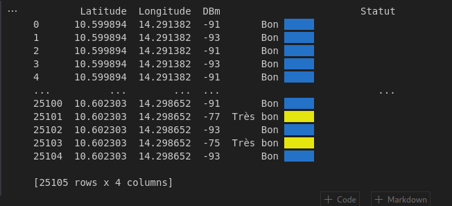

# AsignalM
Network signal in an area.
### Library
```python
import pandas as pd
import numpy as np
import matplotlib.pyplot as plt
import colorama 
```
### read excel file
```python
df=pd.read_excel('gps-baoliwolbon.xlsx')
df
```


```python
hist=df.hist(column='DBm',bins=20)
```


### IF ELSE WITH PANDAS
```python
df.loc[(df['DBm'] <= -51) & (df['DBm'] >= -71), 'Statut'] = 'Excellent' + " " + colorama.Fore.BLACK + colorama.Back.RED + "     " + colorama.Style.RESET_ALL
df.loc[(df['DBm'] <= -75) & (df['DBm'] >= -85), 'Statut'] = 'Très bon' + " " + colorama.Fore.BLACK + colorama.Back.YELLOW + "     " + colorama.Style.RESET_ALL
df.loc[(df['DBm'] <= -85) & (df['DBm'] >= -95), 'Statut'] = 'Bon' + " " + colorama.Fore.BLACK + colorama.Back.BLUE + "     " + colorama.Style.RESET_ALL
df.loc[(df['DBm'] <= -95) & (df['DBm'] >= -105), 'Statut'] = 'Moyen'
df.loc[(df['DBm'] <= -105) & (df['DBm'] >= -115), 'Statut'] = 'Mauvais'
df.loc[(df['DBm'] <= -115), 'Statut'] = 'Très mauvais'
print(df)
```


### Save
```python
file_name = 'SAVE.html'
```
```python
df=pd.DataFrame(df)
df.to_html(file_name)
print('enregistré')
```

```
enregistré
```